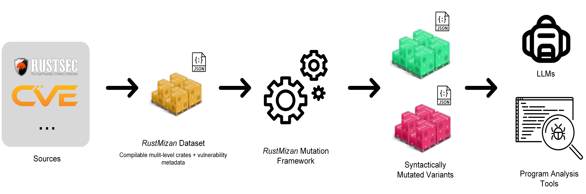

# RustMizan

**RustMizan** (_Mizan_ - Arabic for "scale" or "balance") is an extensible benchmarking framework for evaluating both traditional and LLM-based vulnerability analysis techniques in Rust. It provides a curated dataset of real-world vulnerabilities and supporting infrastructure to enable systematic vulnerability detection research.

## Key Features

- **Fully compilable**: All variants compile with the Rust compiler. This is essential for traditional static analysis tools that operate on compiler intermediate representations (e.g., MIR)

- **Multi-level context**: Each vulnerability is available at crate, file, and function levels. This allows researchers to evaluate how traditional tools handle increasing scale and how LLMs perform with varying amounts of context

- **Contamination-aware**: LLMs train on vast public data, which means they potentially memorize benchmarks rather than genuinely reasoning about vulnerabilities. RustMizan includes semantic-preserving mutations that transform code syntax while preserving vulnerabilities. This enables evaluation of true reasoning capabilities

- **Extensible**: The framework provides infrastructure for researchers to easily add new vulnerabilities and design custom mutations


_Each CVE is packaged as three standalone compilable crates of decreasing scope: the full crate, a single-file reduction, and a single-function reduction. The vulnerable file is tracked across all three levels._

## Getting Started

To build all code variants, run:

```bash
cargo build --workspace
```

> NOTE: The nightly toolchain is required because mizan-mut depends on `rust-analyzer` crates which require nightly features

## End-to-End Usage

```bash
# Checkout and mutate samples
mizan checkout -v vuln-0001 -v vuln-0002 -l function -o output
cd output
mizan mutate -m remove-comments

# Prepare dataset for evaluation
mizan evaluate prepare-dataset --tag comments_removed -o mizan_comments_removed.parquet

# Run evaluation (edit mizan-cli/run_eval.py with the dataset path and config).
# The script is more flexible than CLI flags. You can swap in a custom agent to
# experiment with different prompting strategies or agent architectures.
python mizan-cli/run_eval.py

# View results
inspect view
```

## Project Structure

```
rust-mizan/
├── samples/              # Vulnerability dataset
│   ├── vuln-0001/       # Each CVE in its own directory
│   ├── vuln-0002/
│   └── ...
├── mizan-mut/           # Semantic-preserving mutation tool
└── mizan-cli/           # Python CLI for dataset interaction
```

## Tools

### [mizan-mut](./mizan-mut)

Rust code mutation tool providing semantic-preserving transformations:

- **mutate**: AST-based mutations (e.g., for-to-while loop conversion)
- **rename**: Symbol renaming using `rust-analyzer`

### [mizan-cli](./mizan-cli)

Python CLI for dataset interaction:

- Checkout specific code samples
- Apply mutations to samples
- Run experiments on dataset subsets

## Usage Model



_Curated vulnerable crates (from RustSec, CVE records, and other sources) are manually reduced to multi-level variants, optionally transformed via semantic-preserving mutations, and evaluated with traditional program analysis tools and LLM-based methods._

## Contributing

See [CONTRIBUTING.md](./CONTRIBUTING.md) for guidelines on adding new vulnerabilities to the dataset.

## License

Licensed under the Apache License, Version 2.0. See [LICENSE](./LICENSE).
