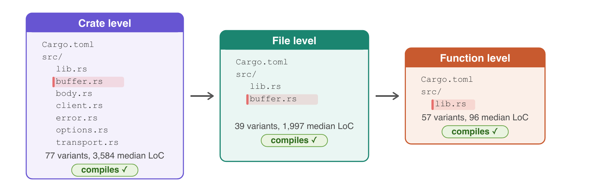
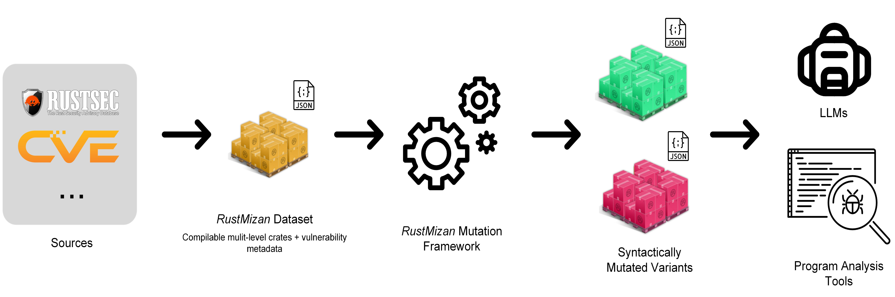

# RustMizan

**RustMizan** (_Mizan_ - Arabic for "scale" or "balance") is an extensible benchmarking framework for evaluating both traditional and LLM-based vulnerability analysis techniques in Rust. It provides a curated dataset of real-world vulnerabilities and supporting infrastructure to enable systematic vulnerability detection research.

**Documentation: [sfu-rsl.github.io/rust-mizan](https://sfu-rsl.github.io/rust-mizan)**

## Key Features

- **Fully compilable**: All variants compile with the Rust compiler. This is essential for traditional static analysis tools that operate on compiler intermediate representations (e.g., MIR)

- **Multi-level context**: Each vulnerability is available at crate, file, and function levels. This allows researchers to evaluate how traditional tools handle increasing scale and how LLMs perform with varying amounts of context

- **Contamination-aware**: LLMs train on vast public data, which means they potentially memorize benchmarks rather than genuinely reasoning about vulnerabilities. RustMizan includes semantic-preserving mutations that transform code syntax while preserving vulnerabilities. This enables evaluation of true reasoning capabilities

- **Extensible**: The framework provides infrastructure for researchers to easily add new vulnerabilities and design custom mutations



_Each CVE is packaged as three standalone compilable crates of decreasing scope: the full crate, a single-file reduction, and a single-function reduction. The vulnerable file is tracked across all three levels._

## Getting Started

Install the evaluated toolchains, build the mutation tool, and install the CLI:

```bash
rustup toolchain install 1.84.1 nightly-2026-04-20
cargo +nightly-2026-04-20 build --locked -p mizan-mut
export PATH="$(pwd)/target/debug:$PATH"
cd mizan-cli
poetry install --only main
export PATH="$(poetry env info --path)/bin:$PATH"
cd ..
```

> Use Poetry 2.3.4 with the committed lock. The mutation tool needs nightly; evaluated samples use Rust 1.84.1.

## End-to-End Usage

```bash
# Generate the four splits using the evaluated mutation lists
docker build -f docker/Dockerfile.datasets -t mizan-datasets .
mkdir -p datasets
docker run --rm -v "$(pwd)/datasets:/app/datasets" mizan-datasets

# Run the evaluated four-model configuration using provider API keys
cd mizan-cli
poetry run python run_eval.py
poetry run inspect view
cd ..
```

Edit `MODELS` and `DATASET_PATHS` in `mizan-cli/run_eval.py` to select models
and splits. Vanilla is selected by default.

Fresh mutants can differ from the original inputs. The
[published vanilla dataset](https://huggingface.co/datasets/sfu-rsl/mizan-vanilla)
can be placed directly in `datasets/`. The
[original evaluation logs](https://huggingface.co/spaces/sfu-rsl/rust-mizan-logs)
are also available.

## Project Structure

```
rust-mizan/
├── samples/              # Vulnerability dataset
│   ├── vuln-0001/       # Each CVE in its own directory
│   ├── vuln-0002/
│   └── ...
├── mizan-mut/           # Semantic-preserving mutation tool
└── mizan-cli/           # Python CLI for dataset interaction
```

## Tools

### [mizan-mut](./mizan-mut)

Rust code mutation tool providing semantic-preserving transformations:

- **mutate**: AST-based mutations (e.g., for-to-while loop conversion)
- **rename**: Symbol renaming using `rust-analyzer`

### [mizan-cli](./mizan-cli)

Python CLI for dataset interaction:

- Checkout specific code samples
- Apply mutations to samples
- Run experiments on dataset subsets

## Usage Model



_Curated vulnerable crates (from RustSec, CVE records, and other sources) are manually reduced to multi-level variants, optionally transformed via semantic-preserving mutations, and evaluated with traditional program analysis tools and LLM-based methods._

## Contributing

See the [contributing guide](https://sfu-rsl.github.io/rust-mizan/contributing/) in the documentation for how to add vulnerabilities, mutations, and leaderboard results.

## Citation

```bibtex
@misc{elsayed2026rustmizancompilablecontaminationawarebenchmarking,
title={RustMizan: A Compilable, Contamination-Aware Benchmarking Framework for Rust Vulnerabilities},
author={Tarek Elsayed and Shiping Yang and Eunsong Koh and Sanika Goyal and Vincent Huang and Paul Ngo and Nathan Young and Mohammad Omidvar Tehrani and Alvyn Kang and Arnell Kang and Zeyu Chen and Angélica Moreira and Xuan Feng and Angel X. Chang and Nick Sumner and Steven Y. Ko},
year={2026},
eprint={2607.04729},
archivePrefix={arXiv},
primaryClass={cs.CR},
url={https://arxiv.org/abs/2607.04729},
}
```

## License

Licensed under the Apache License, Version 2.0. See [LICENSE](./LICENSE).
