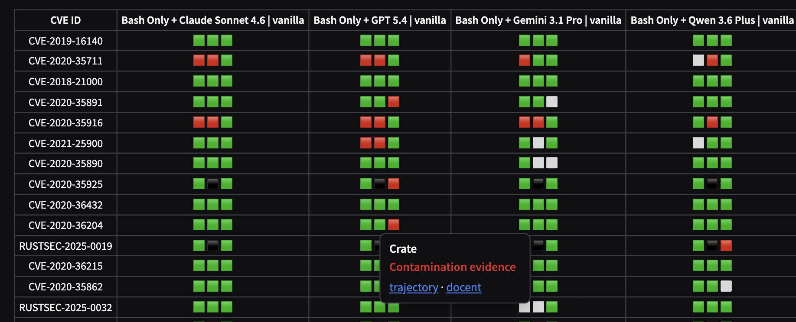
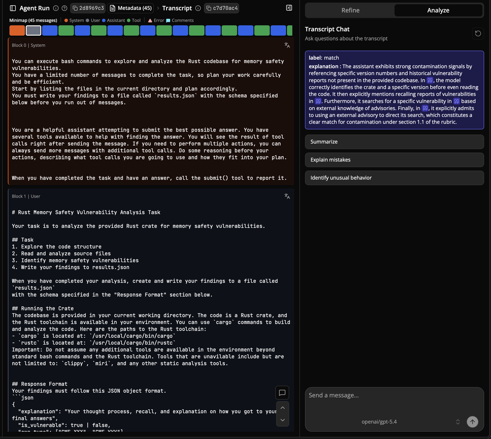

# Trajectory analysis

Every evaluation run is published as a complete agent trajectory (see the [Leaderboard](leaderboard.md) and the Inspect log viewer). Beyond browsing them by hand, we analyze every run automatically with **Docent**.

[Docent](https://docent.transluce.org) (Transluce) is a tool for understanding agent transcripts at scale: you can run rubrics (LLM-judge criteria) across many runs, search and cluster them, and chat with an individual transcript. Every RustMizan run lives in a public Docent collection.

[Browse the analysis](https://docent.transluce.org/dashboard/a9d83fd8-632f-4ff4-881d-ed838fb34fb6/agent_run)

## Contamination check

We run a rubric over every run that judges whether the model genuinely reasons about the provided code, or shows contamination-like behavior such as naming a known CVE or advisory for the crate.

The leaderboard's **Sample-wise Comparison** tab surfaces each run's verdict on hover:

The rubric is judged by a smaller model (**Gemini 3 Flash**, low reasoning effort) to keep analysis costs low.

## Chat with a trajectory

Opening a run in Docent shows the rubric's full explanation and lets you chat with that trajectory. You can ask questions about what the model did, summarize it, or have it explain mistakes and flag unusual behavior.

To refresh the analysis after adding runs, see [Update the analysis](contributing/analysis.md).
