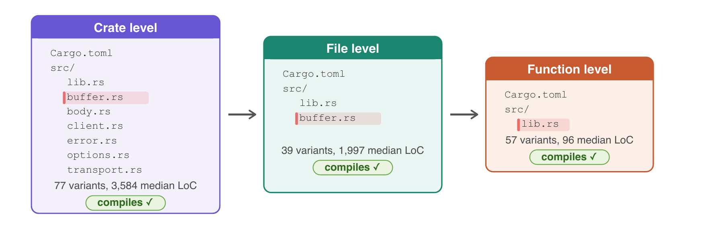

# Dataset

RustMizan focuses on Rust memory-safety vulnerabilities: use-after-free, buffer overflow, double free, and related issues. Every variant traces back to a publicly disclosed CVE. The benchmark is built on real vulnerabilities, not synthetic or injected ones.

## Multi-level compilable variants

Each CVE is packaged as up to three standalone compilable crates of decreasing scope.



- **Crate level**: the full original project.
- **File level**: the vulnerable file plus the files and type definitions needed to compile, packaged as a standalone crate.
- **Function level**: just the vulnerable function and its compile dependencies.

The same vulnerability appears at all three levels, so any difference in analysis accuracy is due to context, not to the vulnerability being harder or easier. Two exceptions apply: single-file crates get only file- and function-level variants, and the function level is skipped when the file is essentially a single function.

## Sourcing

The dataset draws from the [RustSec Advisory Database](https://rustsec.org/), a community-maintained repository of security advisories for Rust crates. Each RustSec entry is mapped to its individual CVE.

- **Vulnerable version**: the commit before the fix, or the version immediately before the patched release.
- **Patched version**: the commit corresponding to the patched release from RustSec. When no official patch is recorded, only the vulnerable variant is included.

All variants are constructed manually and verified to compile. Annotations are derived from CVE descriptions, GitHub issue discussions, commit messages, and code review, and every annotation is peer reviewed by at least one additional researcher.

## Directory layout

```
samples/
├── deps/                      # shared dependency crates
├── vuln-0001/
│   ├── README.md              # CVE description and vulnerability explanation
│   ├── sample-00001-crate/    # vulnerable, crate level
│   ├── sample-00001-file/     # vulnerable, file level
│   ├── sample-00001-function/ # vulnerable, function level
│   ├── sample-10001-crate/    # fixed, crate level
│   ├── sample-10001-file/     # fixed, file level
│   └── sample-10001-function/ # fixed, function level
└── ...
```

### Naming convention

The convention is clear to developers but not immediately obvious to LLMs.

- Vulnerable samples: `sample-0XXXX-level` (first digit `0`).
- Fixed samples: `sample-1XXXX-level` (first digit `1`).
- `XXXX` is the 4-digit vulnerability ID. `level` is `function`, `file`, or `crate`.

For example, `sample-00042-crate` is the vulnerable crate-level variant of `vuln-0042`, and `sample-10042-crate` is its fixed counterpart.

## `mizan.json`

`mizan.json` at the dataset root holds the ground truth. Its top level has `general_information` (benchmark name, rust version, dataset version) and a list of `vulnerabilities`.

Each vulnerability records its `id`, `crate_name`, `year`, source link, and a list of `code_samples`. Each code sample has:

| Field | Type | Meaning |
| --- | --- | --- |
| `path_to_crate` | string | Path relative to `samples/`, e.g. `vuln-0001/sample-00001-function` |
| `is_vulnerability` | bool | `true` for vulnerable samples, `false` for fixed |
| `cwe_type` | list of strings | CWE identifiers, e.g. `["CWE-416"]` |
| `vulnerable_functions` | map | File path to the list of vulnerable function signatures |
| `vulnerable_lines` | map | File path to the list of vulnerable line numbers (1-indexed) |
| `deps` | list of strings | Dependency crate names from `samples/deps/` (empty if none) |

The `level` (granularity) is derived from `path_to_crate`.

## Dependencies

Some samples depend on other crates from the original project's workspace. Those dependency crates live in `samples/deps/`, and each sample lists the ones it needs in its `deps` field. `mizan checkout` copies the referenced dependencies alongside the samples.

To add a vulnerability to the dataset, see [Add a vulnerability](contributing/vulnerabilities.md).
