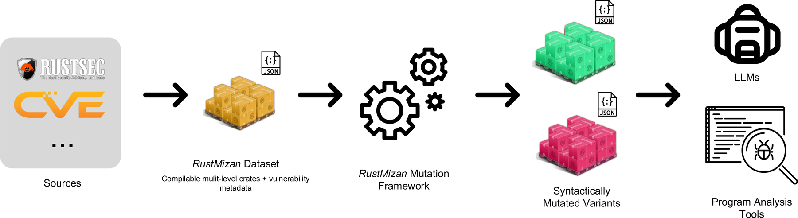

# RustMizan

A compilable, contamination-aware benchmarking framework for Rust vulnerability analysis.

[Get started](getting-started.md) · [GitHub](https://github.com/sfu-rsl/rust-mizan) · [Leaderboard](https://huggingface.co/spaces/sfu-rsl/rust-mizan-leaderboard) · [Trajectories](https://huggingface.co/spaces/sfu-rsl/rust-mizan-logs)

---

**RustMizan** (_Mizan_ - Arabic for "scale" or "balance") evaluates both traditional and LLM-based vulnerability analysis techniques in Rust. It pairs a curated dataset of real-world vulnerabilities with the infrastructure to evaluate them.

The dataset is a curated set of real-world memory-safety CVEs, each packaged as compilable variants at the crate, file, and function levels. Every variant ships with ground-truth annotations for four tasks: Crate Vulnerability Classification (CVC), CWE classification, function localization, and line localization.

## Design principles

- **Fully compilable.** Every variant compiles, so it can be analyzed by traditional tools (static analyzers, formal verification) and explored by agents that build and run the code. See the [Dataset](dataset.md).
- **Multi-level context.** Each vulnerability is available at crate, file, and function levels, so you can study how context granularity affects analysis.
- **Contamination-aware.** A pluggable [mutation framework](mutations/index.md) applies semantic-preserving transformations that change syntax while preserving the vulnerability, so you can probe memorization versus reasoning.
- **Extensible.** Adding a vulnerability or a mutation is a small, well-defined task. See [Contributing](contributing/index.md).
- **Transparent.** Every evaluation run is published as a complete agent trajectory (prompts, reasoning, tool calls, and scoring), browsable in an [Inspect log viewer](https://huggingface.co/spaces/sfu-rsl/rust-mizan-logs) and linked from each result on the [Leaderboard](leaderboard.md).

## How it compares

Most vulnerability benchmarks use non-compilable snippets, fix a single context level, focus on binary detection, and rarely handle contamination or target Rust. RustMizan combines all of these in one benchmark: compilable variants, the same vulnerability at multiple context levels, the full analysis pipeline (CVC, CWE classification, and function- and line-level localization), built-in contamination and robustness testing, and a focus on Rust.

## Where to go next

| If you want to... | Read |
| --- | --- |
| Install and run the full pipeline | [Getting Started](getting-started.md) |
| Understand the dataset and its layout | [Dataset](dataset.md) |
| Use the `mizan` command-line tool | [The mizan CLI](cli.md) |
| Learn the mutations and how they preserve ground truth | [Mutations](mutations/index.md) |
| See how models are scored | [Evaluation](evaluation.md) |
| Read or submit results | [Leaderboard](leaderboard.md) |
| Add a vulnerability, a mutation, or results | [Contributing](contributing/index.md) |

## Acknowledgements

This work is done at the [Reliable Systems Lab](https://github.com/sfu-rsl) at Simon Fraser University, led by [Dr. Steven Ko](https://steveyko.github.io).

Licensed under the Apache License, Version 2.0.
