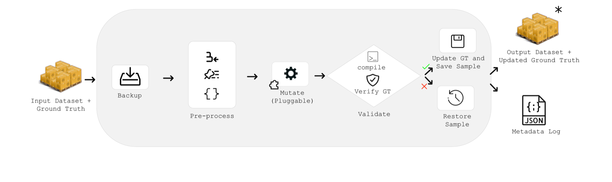
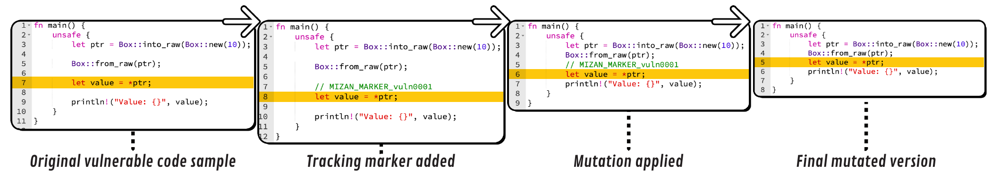

# Mutations

RustMizan pairs the dataset with an extensible mutation framework. Every mutation is **semantically preserving**: it changes code syntax without altering program behavior, so the underlying vulnerability is intact but its surface form differs.

Mutations serve two purposes. **Contamination** mutations break token-level memorization to test whether a model recalls a benchmark rather than reasoning about it. **Robustness** mutations inject misleading cues to test whether a model resists surface-level deception.

For the before/after form of each mutation, see [Mutation specification](specification.md). For the underlying Rust AST tool, see [mizan-mut](mizan-mut.md).

## Categories

Mutations are grouped into three categories, which map to the dataset variants used on the [Leaderboard](../leaderboard.md).

### Contamination (benign)

Strip or rewrite surface syntax so memorized snippets no longer match.

| Mutation | Description |
| --- | --- |
| `remove-comments` | Remove all Rust comments |
| `format-compact` | Apply compact `rustfmt` formatting |
| `format-expanded` | Apply expanded `rustfmt` formatting |
| `mizan-mut-for-to-while` | Convert `for` loops to `while` loops |
| `mizan-mut-while-to-loop` | Convert `while` loops to `loop` blocks with breaks |
| `mizan-mut-if-else-reorder` | Reorder if-else branches by negating conditions |
| `benign-comments` | Insert neutral comments around vulnerable lines |
| `benign-blocks` | Insert neutral code blocks around vulnerable lines |
| `benign-rename-fn` | Rename functions to neutral names (e.g. `fn_1_abc123`) |
| `benign-rename-var` | Rename variables to neutral names (e.g. `var_1_xyz789`) |

### Robustness (malignant)

Inject adversarial cues that falsely suggest the code is safe.

| Mutation | Description |
| --- | --- |
| `malignant-comments` | Insert comments falsely suggesting the code is safe |
| `malignant-blocks` | Insert code blocks falsely suggesting safety |
| `malignant-rename-fn` | Rename functions to safety-implying names (e.g. `safe_fn_1`) |
| `malignant-rename-var` | Rename variables to safety-implying names (e.g. `secure_var_1`) |

### Rust-specific

Structural transformations that leverage Rust syntax, implemented as AST transformations in [mizan-mut](mizan-mut.md).

| Mutation | Description |
| --- | --- |
| `derive-reorder` | Reorder traits in `#[derive(...)]` attributes |
| `trait-bound-reorder` | Reorder trait bounds in `where` clauses |
| `use-reorder` | Reorder items in `use` statements |
| `arithmetic-identity` | Wrap integer literals with a multiplication identity (`N * 1`) |
| `explicit-where` | Add an explicit `where` clause to a signature |
| `explicit-where-to-type-params` | Move simple type bounds from a `where` clause into the type parameters |
| `rename-lifetime` | Rename lifetime parameters consistently |
| `impl-trait-to-generic` | Convert `impl Trait` bounds into generic parameters |
| `option-wrap` | Wrap expressions in a redundant `Some(...).unwrap()` |
| `maybeuninit-wrap` | Round-trip a value through `MaybeUninit<T>` |
| `manuallydrop-wrap` | Wrap an owned variable in `ManuallyDrop`, then unwrap it |
| `explicit-return` | Convert implicit returns to explicit `return` statements |
| `unreachable-panic` | Guard a function body with an unreachable `panic!()` arm |
| `repeated-shadowing` | Add redundant repeated shadows for `let` bindings |

See the [specification](specification.md) for before/after examples.

> Mutations prefixed with `mizan-mut-` and all rename mutations call the [`mizan-mut`](mizan-mut.md) binary, which must be installed and on your `PATH`.

## The pipeline

For each sample, the framework backs up the original, applies the mutation, then validates that the result still compiles and that the ground truth is preserved. If any step fails, it rolls back to the backup. Successful mutations are saved; the rest are logged.

## Ground-truth tracking

Mutations change the ground truth: renaming a function invalidates annotations that reference it by name, and inserting code shifts line numbers. The framework keeps annotations accurate with three mechanisms.

- **Marker tracking.** For most mutations, a unique comment marker (e.g. `// MIZAN_MARKER_vuln0001`) is inserted before each vulnerable line. After the mutation, the marker's new position gives the corrected line number, and the marker is removed.
- **Content-based tracking.** AST-based `mizan-mut-*` mutations remove all comments (including markers) when they parse and regenerate the code, so vulnerable lines are tracked by their content instead. If a line appears multiple times or cannot be found after mutation, that file is excluded and the mutation is re-applied. Such cases are recorded as `partial_mutations`.
- **Rename tracking.** Rename mutations legitimately change line content, so the validator allows content differences for them.

## Output files

- **Updated `mizan.json`** with corrected vulnerable line numbers.
- **`mizan_mutations.json`** logging `mutations_applied`, `skipped` (mutations or samples that were skipped), and `partial_mutations`.

A "successful" mutation means the process completed without error, not that code necessarily changed. Applying `for-to-while` to code with no `for` loops succeeds without making changes.

## Ordering caveats

Mutations are applied in the order you list them. Be deliberate:

- Don't run `for-to-while` then `while-to-loop` unless you intend to turn `for` loops into `loop` blocks.
- Don't run `benign-comments` then `remove-comments`; the inserted comments will be stripped.

To add a new mutation, see [Add a mutation](../contributing/mutations.md).
