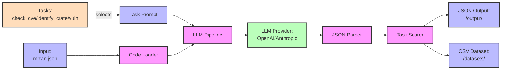

# Sprout Pipeline

Sprout Pipeline is a lightweight toolkit for analyzing Rust crates using LLMs. It processes Rust code, sends it to an LLM with specific prompts, receives structured JSON responses, and automatically scores these responses against ground-truth data.

## Architecture



## Installation

[Poetry](https://python-poetry.org/) is required for local development.

### Local Development

```bash
poetry install
```

### System-wide Installation

```bash
poetry build

pip uninstall -y sprout-pipeline
pip install dist/sprout_pipeline-*.whl
```

## Environment Variables

Set at least one API key before running:

```bash
# For OpenAI models
export OPENAI_API_KEY="sk-..."

# For Anthropic Claude models (optional)
export ANTHROPIC_API_KEY="sk-..."
```

## Tasks

Sprout Pipeline includes three built-in tasks:

| Task Name        | Description                                                                  | Prompt File                       | Code Required |
| ---------------- | ---------------------------------------------------------------------------- | --------------------------------- | ------------- |
| `check_cve`      | Predict whether CVEs exist for a crate in a specific year (without the code) | `prompts/check_cve.md`            | No            |
| `identify_crate` | Identify crate name, year, and CVEs from source code                         | `prompts/identify_crate.md`       | Yes           |
| `vuln`           | Detect and localize memory-safety vulnerabilities                            | `prompts/detect_vulnerability.md` | Yes           |

## Usage

> If you install the package system-wide, you can run the command directly without `poetry run`.

### Common Arguments

- `--task`: The analysis task to run (required)
- `--input`: Path to `mizan.json` file (required)
- `--provider`: LLM provider to use: "openai" or "anthropic" (default: "openai")
- `--model`: Model name to use (default: "gpt-4o-mini")
- `--prompt`: Override the default prompt file (optional)
- `--out`: Override the output JSON path (use "-" for stdout)

### 1. Check CVE Task

> This task runs only once per vulnerability (not code sample).

To run the CVE check task, use the following command:

```bash
poetry run sprout-run-task \
  --task check_cve \
  --input mizan.json \
  --provider openai \
  --model gpt-4o-mini
```

Output Format:

```json
{
  "crate_name": "example-crate",
  "year": 2023,
  "has_cve": true,
  "cve_list": ["CVE-2023-12345"]
}
```

### 2. Identify Crate Task

To run the crate identification task, use the following command:

```bash
poetry run sprout-run-task \
  --task identify_crate \
  --input mizan.json \
  --provider openai \
  --model gpt-4o-mini
```

Output Format:

```json
{
  "crate_name": "identified-crate",
  "likely_year": 2023,
  "has_cve": true,
  "cve_list": ["CVE-2023-12345"]
}
```

### 3. Vulnerability Detection Task

Run:

```bash
poetry run sprout-run-task \
  --task vuln \
  --input mizan.json \
  --provider openai \
  --model gpt-4o-mini
```

Output Format:

```json
{
  "is_vulnerable": true,
  "cwe_type": ["CWE-416"],
  "vulnerable_functions": {
    "src/lib.rs": ["fn vulnerable_function(ptr: mut u8)"]
  },
  "vulnerable_lines": {
    "src/lib.rs": [42, 43]
  }
}
```

## Output Files

After each run, Sprout writes:

- `output/<task>/<provider-model>/<timestamp>.json`: Raw model answers plus scoring details
- `datasets/<task>/<provider-model>/<timestamp>.csv`: Flattened table ready for analysis

## Extending Sprout Pipeline

To create a new task:

1. Create a Pydantic model in `models.py`
2. Create a new task class in `tasks/` that inherits from `TaskBase`
3. Create a prompt file in `prompts/`
4. Register the task in `tasks/__init__.py`
